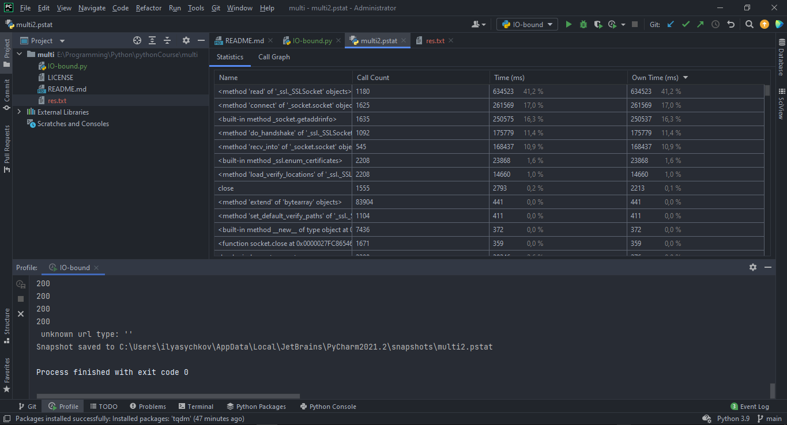
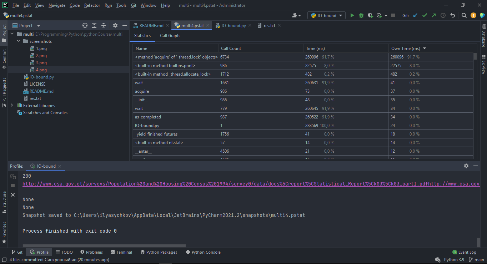
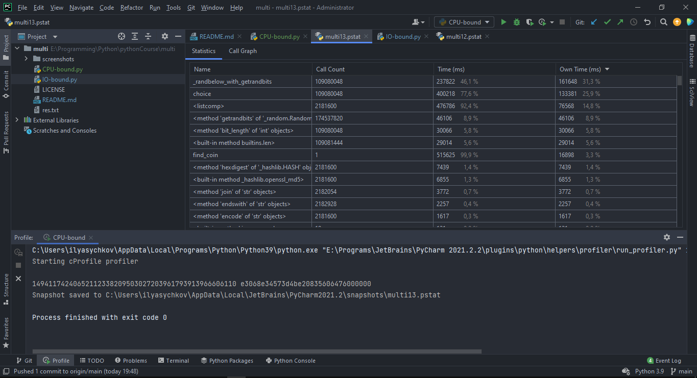
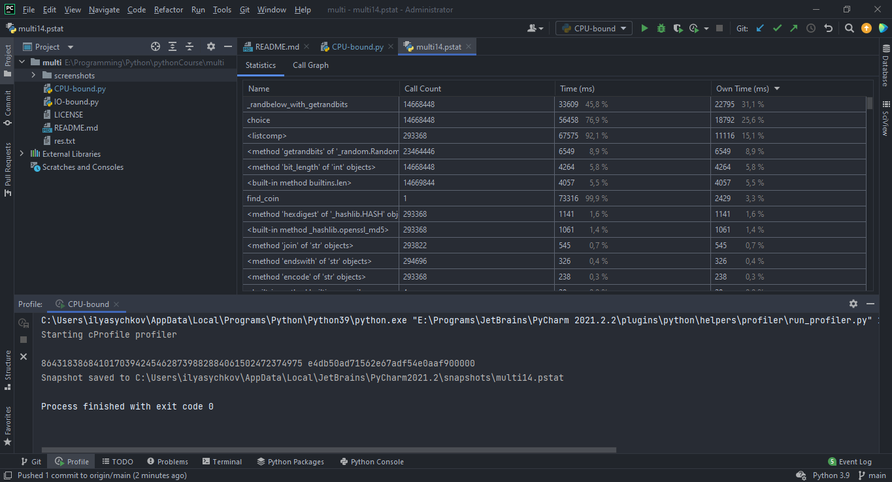

# Сычков Илья АТ-28
## IO-bound
### Время синхронной проверки ссылок

### Нагрузка и время асинхронной проверки ссылок с 5 воркерами


### Нагрузка и время асинхронной проверки ссылок с 10 воркерами


### Нагрузка и время асинхронной проверки ссылок со 100 воркерами


### Зависимость:
с увеличением количества воркеров: загрузка памяти увеличивается, загрузка процессора увеличивается, загрузка сети не меняется, время работы уменьшается. 

## CPU-bound
## Скорость генерации 1 монеты на 1 ядре
Больше 40 минут, не дождался
## Нагрузка и время асинхронной генерации с 2 воркерами


## Нагрузка и время асинхронной генерации с 10 воркерами


# Параллелизм и асинхронность

Мы затронем только самые общие аспекты работы с потоками и процессами. Задачи, которые мы будем рассматривать обладают свойством [чрезвычайная параллельности](https://ru.wikipedia.org/wiki/%D0%A7%D1%80%D0%B5%D0%B7%D0%B2%D1%8B%D1%87%D0%B0%D0%B9%D0%BD%D0%B0%D1%8F_%D0%BF%D0%B0%D1%80%D0%B0%D0%BB%D0%BB%D0%B5%D0%BB%D1%8C%D0%BD%D0%BE%D1%81%D1%82%D1%8C).

Образцом для работы мы примем два куска кода из примера документации CPython для модуля [concurrent.futures](https://docs.python.org/3/library/concurrent.futures.html). Класc, больше подходящий для IO-bound задач: `ThreadPoolExecutor` (используются потоки), а для CPU-bound &mdash; `ProcessPoolExecutor` (используются процессы). Оба работают по принципу запуска одноранговых воркеров с некоторой функцией внутри (как кассы в &laquo;Пятерочке&raquo;).

## ThreadPoolExecutor

```python
import concurrent.futures
import urllib.request

URLS = ['http://www.foxnews.com/',
        'http://www.cnn.com/',
        'http://europe.wsj.com/',
        'http://www.bbc.co.uk/',
        'http://some-made-up-domain.com/']

# Retrieve a single page and report the URL and contents
def load_url(url, timeout):
    with urllib.request.urlopen(url, timeout=timeout) as conn:
        return conn.read()

# We can use a with statement to ensure threads are cleaned up promptly
with concurrent.futures.ThreadPoolExecutor(max_workers=5) as executor:
    # Start the load operations and mark each future with its URL
    future_to_url = {executor.submit(load_url, url, 60): url for url in URLS}
    for future in concurrent.futures.as_completed(future_to_url):
        url = future_to_url[future]
        try:
            data = future.result()
        except Exception as exc:
            print('%r generated an exception: %s' % (url, exc))
        else:
            print('%r page is %d bytes' % (url, len(data)))
```
## ProcessPoolExecutor

```python
import concurrent.futures
import math

PRIMES = [
    112272535095293,
    112582705942171,
    112272535095293,
    115280095190773,
    115797848077099,
    1099726899285419]

def is_prime(n):
    if n < 2:
        return False
    if n == 2:
        return True
    if n % 2 == 0:
        return False

    sqrt_n = int(math.floor(math.sqrt(n)))
    for i in range(3, sqrt_n + 1, 2):
        if n % i == 0:
            return False
    return True

def main():
    with concurrent.futures.ProcessPoolExecutor() as executor:
        for number, prime in zip(PRIMES, executor.map(is_prime, PRIMES)):
            print('%d is prime: %s' % (number, prime))

if __name__ == '__main__':
    main()
```

Возврат в синхронный код происходит благодаря использованию генератора `concurrent.futures.as_completed`, который возвращает результаты по мере готовности их в воркерах. Ручная синхронизация отсутствует, что очень удобно.

Помните о том, что в CPython есть [GIL](https://docs.python.org/3/glossary.html#term-global-interpreter-lock), что не позволяет эффективно работать с потоками в CPU-bound задачах.

### IO-bound. Проверяем ссылки на страницах Википедии

Википедия &mdash; вторичный источник информации: высказывания в ней должны опираться на авторитетные источники в виде ссылок. Публикация оригинальных исследований запрещена. Со временем ссылки становятся нерабочими (сайт сделал редизайн, DNS больше не принадлежит владельцам, за хостинг не заплатили, сервис закрылся).

Давайте попытаемся оценить количество неработающих ссылок. Возьмем 100 случайных страниц Википедии (пройдем по ссылке [Случайная страница](https://ru.wikipedia.org/wiki/%D0%A1%D0%BB%D1%83%D0%B6%D0%B5%D0%B1%D0%BD%D0%B0%D1%8F:%D0%A1%D0%BB%D1%83%D1%87%D0%B0%D0%B9%D0%BD%D0%B0%D1%8F_%D1%81%D1%82%D1%80%D0%B0%D0%BD%D0%B8%D1%86%D0%B0)). 

```python
from urllib.request import urlopen
from urllib.parse import unquote
from bs4 import BeautifulSoup

url = 'https://ru.wikipedia.org/wiki/%D0%A1%D0%BB%D1%83%D0%B6%D0%B5%D0%B1%D0%BD%D0%B0%D1%8F:%D0%A1%D0%BB%D1%83%D1%87%D0%B0%D0%B9%D0%BD%D0%B0%D1%8F_%D1%81%D1%82%D1%80%D0%B0%D0%BD%D0%B8%D1%86%D0%B0'

for i in range(100):
    s = urlopen(url)
    print(unquote(s.url))

##https://ru.wikipedia.org/wiki/Бурасы
##https://ru.wikipedia.org/wiki/Волшебный_куст
##https://ru.wikipedia.org/wiki/Льюис,_Леннокс
##https://ru.wikipedia.org/wiki/Ильинская_Поповка
##https://ru.wikipedia.org/wiki/Стрельцов,_Василий_Витальевич
##https://ru.wikipedia.org/wiki/Anasimyia
##https://ru.wikipedia.org/wiki/Малая_Осница
##https://ru.wikipedia.org/wiki/Владимиров,_Георгий_Петрович
##https://ru.wikipedia.org/wiki/Bhutan_Today
##https://ru.wikipedia.org/wiki/Польтроньери,_Альберто
##https://ru.wikipedia.org/wiki/Радзивилл,_Мартин_Николай
##https://ru.wikipedia.org/wiki/Эренрайк,_Олден
```

Из полученных страниц извлечем все ссылки и сохраним их в файл.

```python
from urllib.request import urlopen
from urllib.parse import unquote
from bs4 import BeautifulSoup
from tqdm import tqdm

url = 'https://ru.wikipedia.org/wiki/%D0%A1%D0%BB%D1%83%D0%B6%D0%B5%D0%B1%D0%BD%D0%B0%D1%8F:%D0%A1%D0%BB%D1%83%D1%87%D0%B0%D0%B9%D0%BD%D0%B0%D1%8F_%D1%81%D1%82%D1%80%D0%B0%D0%BD%D0%B8%D1%86%D0%B0'

res = open('res.txt', 'w', encoding='utf8')

for i in tqdm(range(100)):
    html = urlopen(url).read().decode('utf8')
    soup = BeautifulSoup(html, 'html.parser')
    links = soup.find_all('a')

    for l in links:
        href = l.get('href')
        if href and href.startswith('http') and 'wiki' not in href:
            print(href, file=res)
```

Попробуем теперь синхронно, в 1 поток спрашивать каждую ссылку. Возможно иногда будет 404, возможно будет ошибка соединения.

```python
from urllib.request import Request, urlopen
from urllib.parse import unquote

links = open('res.txt', encoding='utf8').read().split('\n')

for url in links:
    try:
        request = Request(
            url,
            headers={'User-Agent': 'Mozilla/5.0 (Windows NT 9.0; Win65; x64; rv:97.0) Gecko/20105107 Firefox/92.0'},  
        )
        resp = urlopen(request, timeout=5)
        code = resp.code
        print(code)
        resp.close()
    except Exception as e:
        print(url, e)
```

* Замерьте время синхронной проверки ссылок.
* Перепишите код, используя `ThreadPoolExecutor`. 
* Изменяйте количество воркеров: 5, 10, 100.
* Во время работы посмотрите с использованием стандартных утилит вашей OC загрузку памяти, процессора, сети, время работы. Зависят ли они от количества воркеров и как?

## CPU-bound. Генерируем монетки

Придумаем некоторый прототип криптовалюты, построенный на концепции [Proof of work](https://en.wikipedia.org/wiki/Proof_of_work). Монетой будет считаться некоторая строка длины 50 из последовательности цифр 0-9, у которой md5-hash заканчивается на `00000`. Так как md5 &mdash; односторонняя функция, мы не можем по ее результату судить об аргументе, найти монеты мы можем только одим способом &mdash; перебором.

```python
from hashlib import md5
from random import choice


while True:
    s = "".join([choice("0123456789") for i in range(50)])
    h = md5(s.encode('utf8')).hexdigest()

    if h.endswith("00000"):
        print(s, h)
```

Я нашел несколько монет:

```
91625571520935147263403534421427761877088219542499 8adaf58d5c51fc1216820c1201100000
49262841446921579383645162499800846153508846372671 974d52bc5430d4c8ed96963648e00000
34359601233782192016006582448729953029075086207271 0209b01867080f7eaf20f6c674000000
02809251779741159345845523287375801745436182367614 2fd27ad5f1d1efe1f000c3ee66f00000
```

У нас отсутсвует Блокчейн, то есть мы не можем доказать, что монета была сгенерирована именно нами или принадлежит нам: если мы кому-то ее покажем, ее тут же украдут. Эту часть мы оставим за рамками задания.

* Замерьте скорость герации на 1 ядре у вас на компьютере.
* Ускорьтесь за счет использования `ProcessPoolExecutor`.
* Изменяйте количество воркеров: 2, 4, 5, 10, 100.
* Во время работы посмотрите с использованием стандартных утилит вашей OC загрузку памяти, процессора, сети, время работы. Зависят ли они от количества воркеров и как?
* Убедитесь в том, что так как задача CPU bound, наращивать количество воркеров, большее количества ядер, бесполезно.
